```{r setup, include=FALSE}
knitr::opts_chunk$set(
  echo    = TRUE,
  message = FALSE,
  warning = FALSE,
  fig.align = "center",
  fig.width = 10,
  fig.height = 7,
  dpi     = 150,
  cache   = FALSE
)

# Load all packages
suppressPackageStartupMessages({
  library(tidyverse)
  library(tidymodels)
  library(themis)
  library(ranger)
  library(xgboost)
  library(kernlab)
  library(shapviz)
  library(kernelshap)
  library(vip)
  library(patchwork)
  library(gt)
  library(scales)
  library(RWeka)
  library(ggridges)
  library(corrplot)
})

# Run the full pipeline (sources all scripts) or load saved objects
# Option A: re-run everything (slower, ensures fresh outputs)
# source("../R/run_all.R")

# Option B: load saved model objects (fast, for rendering only)
best_lr      <- readRDS("../outputs/models/best_lr.rds")
best_rf      <- readRDS("../outputs/models/best_rf.rds")
best_xgb     <- readRDS("../outputs/models/best_xgb.rds")
best_svm     <- readRDS("../outputs/models/best_svm.rds")
test_results <- readRDS("../outputs/models/test_results.rds")
cv_results   <- readRDS("../outputs/models/cv_results.rds")

# Reload data
source("../R/load_and_eda.R")
source("../R/preprocessing.R")
```

---

# Clinical Background

Diabetic retinopathy (DR) is a microvascular complication of diabetes affecting the retina. It is the **leading cause of preventable blindness in working-age adults worldwide**. Fundus photography enables non-invasive screening, but qualified ophthalmology review is resource-intensive and unavailable in many settings.

Automated classification of retinal features can triage patients, flagging those who need urgent specialist review. The central tension in this screening problem:

> **False negative (missed DR)** → delayed treatment → preventable vision loss  
> **False positive (wrong flag)** → unnecessary specialist referral → cost and patient anxiety

This asymmetry means **sensitivity is the primary metric** — we must catch nearly all DR cases, even at the cost of some false positives. This framing drives every modeling decision below.

---

# Dataset

```{r data-overview}
cat("Dimensions:", nrow(dr_raw), "patients ×", ncol(dr_raw), "features\n\n")

dr_raw %>%
  summarise(
    n_patients     = n(),
    n_features     = ncol(.) - 1,
    pct_dr         = round(mean(label == "DR Present") * 100, 1),
    missing_values = sum(is.na(.))
  ) %>%
  gt() %>%
  cols_label(
    n_patients     = "Patients",
    n_features     = "Features",
    pct_dr         = "DR Positive (%)",
    missing_values = "Missing Values"
  ) %>%
  tab_header(title = "Dataset Summary") %>%
  tab_style(style = cell_text(weight = "bold"),
            locations = cells_column_labels())
```

## Feature Description

```{r feature-table, echo=FALSE}
feature_glossary <- tribble(
  ~Feature,           ~Type,      ~Clinical_Meaning,
  "quality",          "Binary",   "Image quality assessment — 1 = sufficient for analysis",
  "pre_screening",    "Binary",   "Pre-screening flag for severe retinal abnormality",
  "ma_detect_0.5–1.0","Numeric",  "Microaneurysm detections at confidence levels 0.5 to 1.0",
  "exudate_1–8",      "Numeric",  "Normalized exudate features — lipid deposits signaling vascular leakage",
  "macula_od_dist",   "Numeric",  "Euclidean distance from macula to optic disc (normalized)",
  "optic_disc_diam",  "Numeric",  "Optic disc diameter",
  "amfm_class",       "Binary",   "AM/FM-based pre-classifier output",
  "label",            "Target",   "1 = Diabetic Retinopathy detected, 0 = no DR"
)

feature_glossary %>%
  gt() %>%
  tab_header(title = "Clinical Feature Glossary") %>%
  cols_label(
    Feature         = "Feature Name",
    Type            = "Type",
    Clinical_Meaning = "Clinical Interpretation"
  ) %>%
  tab_style(
    style     = cell_fill(color = "#fff3cd"),
    locations = cells_body(rows = Feature == "label")
  ) %>%
  tab_style(style = cell_text(weight = "bold"),
            locations = cells_column_labels())
```

---

# Exploratory Data Analysis

## Class Distribution

```{r class-distribution, fig.height=5}
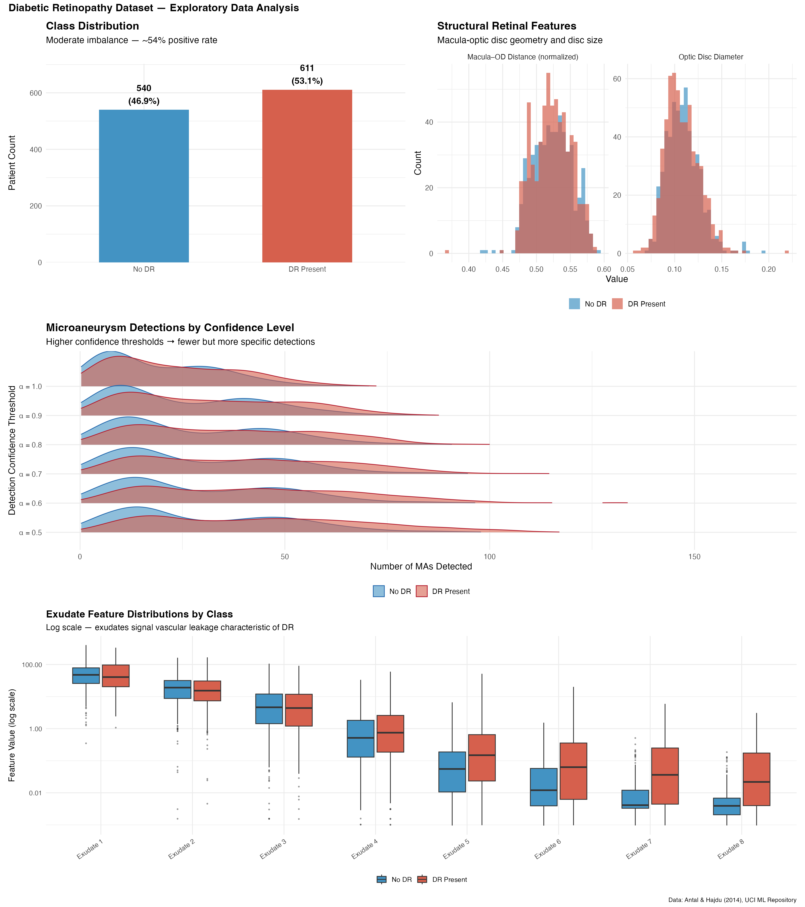
```

The dataset shows **moderate class imbalance** (~54% positive). While this is not extreme, it is enough to distort accuracy-based metrics and warrants SMOTE oversampling during training.

## Feature Correlations

```{r correlation-heatmap}
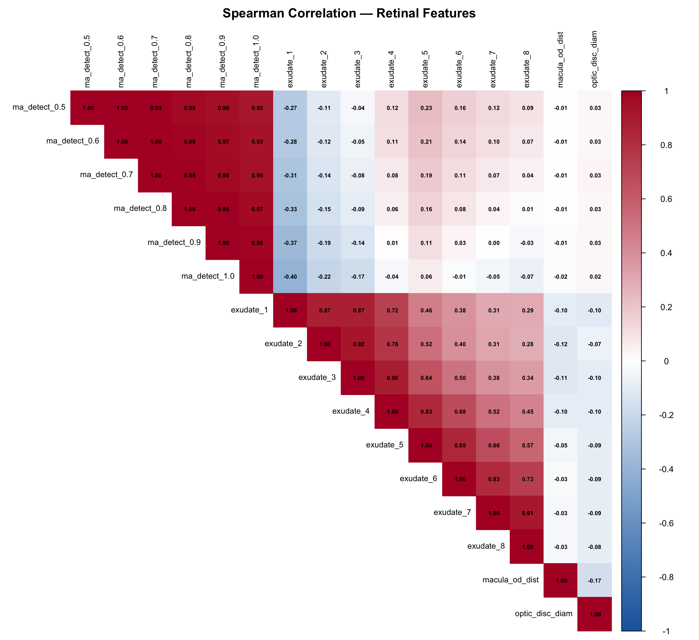
```

**Key observations:**
- MA detection features at adjacent confidence levels are highly correlated (expected — a lesion detected at 0.7 confidence is almost always detected at 0.5)
- Exudate features show moderate inter-correlation
- Macula distance and optic disc diameter are largely independent of other features
- These correlations motivate **regularization** in logistic regression and are handled naturally by tree-based ensembles

---

# Methods

## Train/Test Split & Cross-Validation

```{r split-summary}
tibble(
  Split       = c("Training", "Test"),
  N           = c(nrow(dr_train), nrow(dr_test)),
  `DR %`      = c(
    round(mean(dr_train$label == "DR Present") * 100, 1),
    round(mean(dr_test$label  == "DR Present") * 100, 1)
  )
) %>%
  gt() %>%
  tab_header(title = "Stratified 80/20 Split") %>%
  tab_style(style = cell_text(weight = "bold"),
            locations = cells_column_labels())
```

**5-fold stratified cross-validation** was used for hyperparameter tuning on the training set. SMOTE was applied *inside each fold* during training — a critical step to prevent synthetic sample leakage into validation sets.

## Preprocessing Pipeline

```{r recipe-summary}
dr_recipe
```

## Models

| Model | Hyperparameters Tuned | Rationale |
|-------|----------------------|-----------|
| L2 Logistic Regression | Penalty λ | Clinical baseline; interpretable log-odds coefficients |
| Random Forest | mtry, min_n | Strong ensemble; native importance; handles correlated features |
| XGBoost | trees, depth, learning rate, subsampling, mtry, loss reduction | State-of-the-art tabular performance |
| SVM (RBF) | cost, σ | Effective on smaller clinical datasets; non-linear boundaries |

---

# Results

## Cross-Validation Performance

```{r cv-results}
cv_results_tbl <- cv_results %>%
  pivot_wider(
    names_from  = .metric,
    values_from = c(mean, std_err),
    values_fn   = list(mean = ~ mean(.x, na.rm = TRUE),
                       std_err = ~ mean(.x, na.rm = TRUE))
  ) %>%
  select(model, mean_roc_auc, mean_sensitivity, mean_specificity) %>%
  mutate(across(starts_with("mean_"), as.numeric)) %>%
  mutate(across(starts_with("mean_"), ~ round(.x, 4)))

cv_results_tbl %>%
  gt() %>%
  tab_header(
    title    = "Cross-Validation Performance",
    subtitle = "Best hyperparameters per model | 5-fold stratified CV on training set"
  ) %>%
  cols_label(
    model            = "Model",
    mean_roc_auc     = "AUROC",
    mean_sensitivity = "Sensitivity",
    mean_specificity = "Specificity"
  ) %>%
  fmt_number(columns = starts_with("mean_"), decimals = 4) %>%
  tab_style(
    style = cell_fill(color = "#d4edda"),
    locations = cells_body(
      rows = mean_roc_auc == max(mean_roc_auc, na.rm = TRUE)
    )
  ) %>%
  tab_style(
    style = cell_text(weight = "bold"),
    locations = cells_column_labels()
  )
```

## ROC Curves

```{r roc-curves}
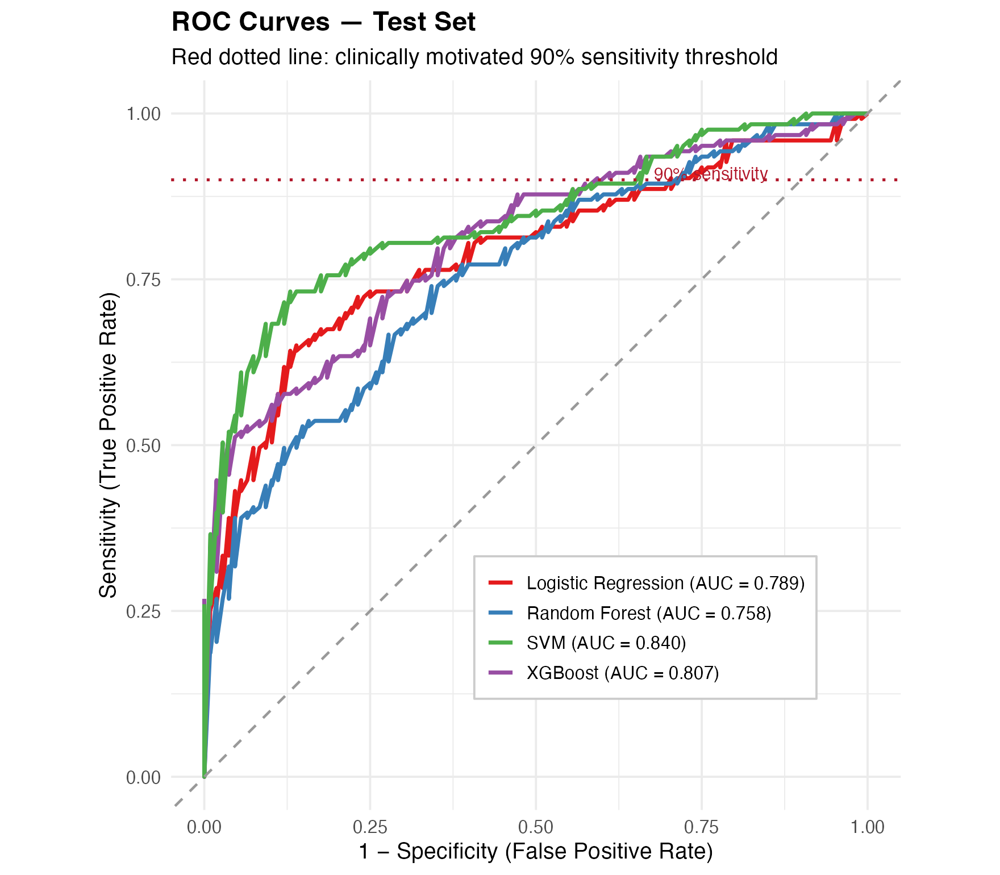
```

## Precision-Recall Curves

```{r pr-curves}
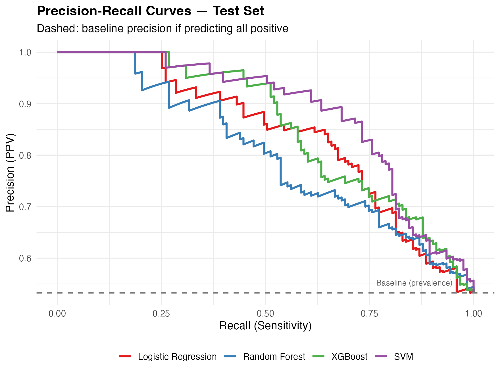
```

Precision-Recall curves are more informative than ROC in screening settings because they directly show the **tradeoff between catching cases (recall/sensitivity) and avoiding false referrals (precision/PPV)**.

## Confusion Matrices at 90% Sensitivity Threshold

```{r confusion-matrices}
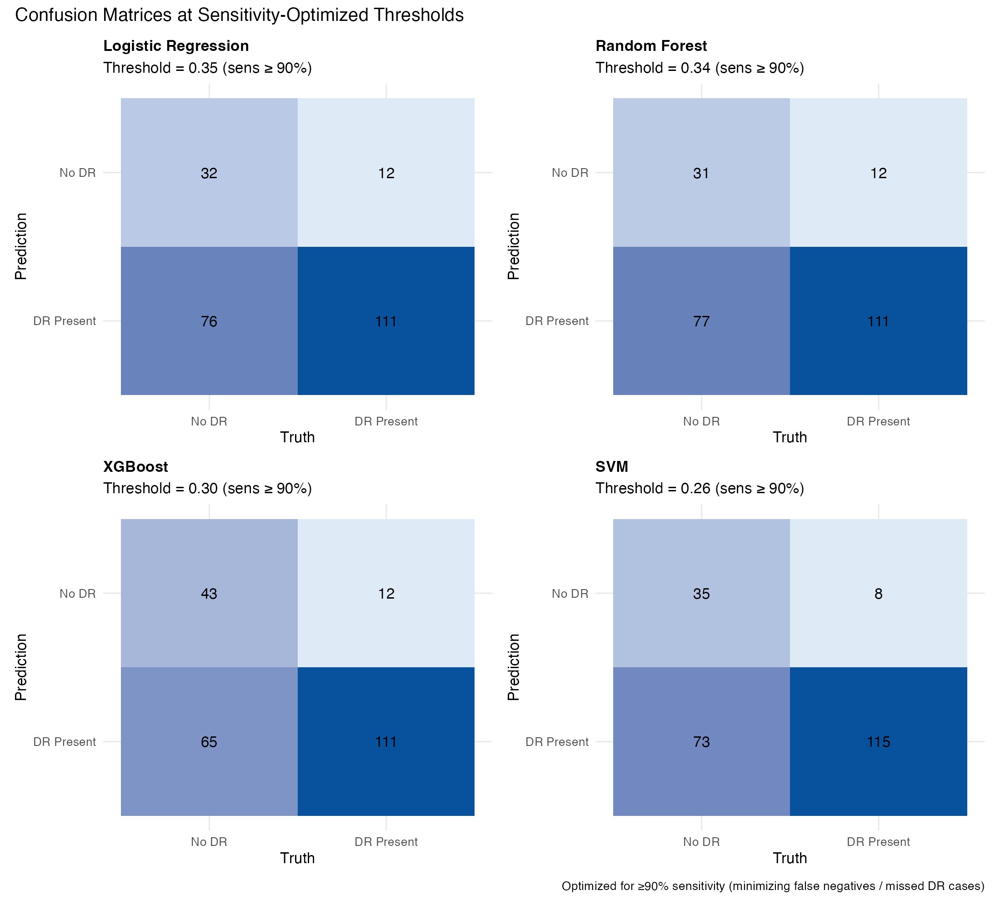
```

In a clinical screening workflow, we would typically **lower the classification threshold** from 0.5 to whatever value achieves ≥90% sensitivity, accepting more false positives in exchange for catching nearly all true DR cases.

## Threshold Tradeoff Analysis

```{r threshold-tradeoff}
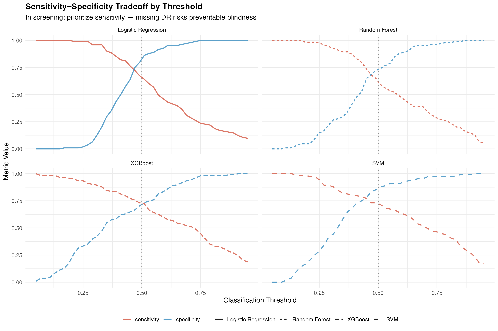
```

## Calibration (XGBoost)

```{r calibration}
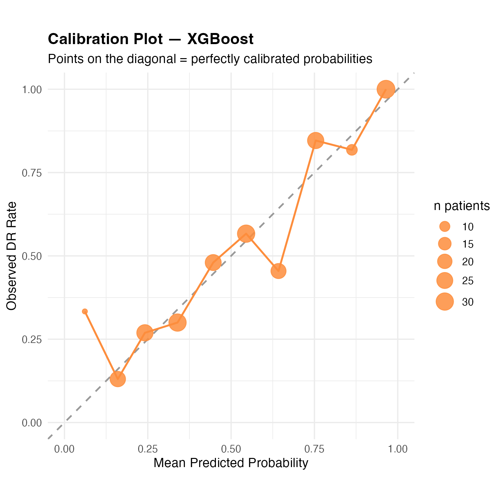
```

Calibration assesses whether predicted probabilities are reliable. A perfectly calibrated model would have all points on the diagonal. Well-calibrated probability estimates are essential for **clinical risk stratification** — a patient with 85% predicted DR probability should genuinely have ~85% prevalence of DR.

## Final Test Set Results

```{r final-results}
test_results %>%
  select(model, AUROC, Sensitivity_default = Sensitivity,
         Specificity_default = Specificity,
         threshold_opt = threshold, sensitivity_opt = sensitivity,
         specificity_opt = specificity) %>%
  gt() %>%
  tab_header(
    title    = "Test Set Performance",
    subtitle = "Default threshold (0.5) vs. sensitivity-optimized threshold (≥90% sens)"
  ) %>%
  tab_spanner(
    label   = "Default Threshold (0.5)",
    columns = c(AUROC, Sensitivity_default, Specificity_default)
  ) %>%
  tab_spanner(
    label   = "Optimized Threshold (≥90% sensitivity)",
    columns = c(threshold_opt, sensitivity_opt, specificity_opt)
  ) %>%
  fmt_number(columns = where(is.numeric), decimals = 4) %>%
  tab_style(
    style     = cell_fill(color = "#d4edda"),
    locations = cells_body(rows = AUROC == max(AUROC))
  ) %>%
  tab_style(style = cell_text(weight = "bold"),
            locations = cells_column_labels())
```

---

# Model Interpretability

## Variable Importance: RF vs XGBoost

```{r vip, fig.height=12}
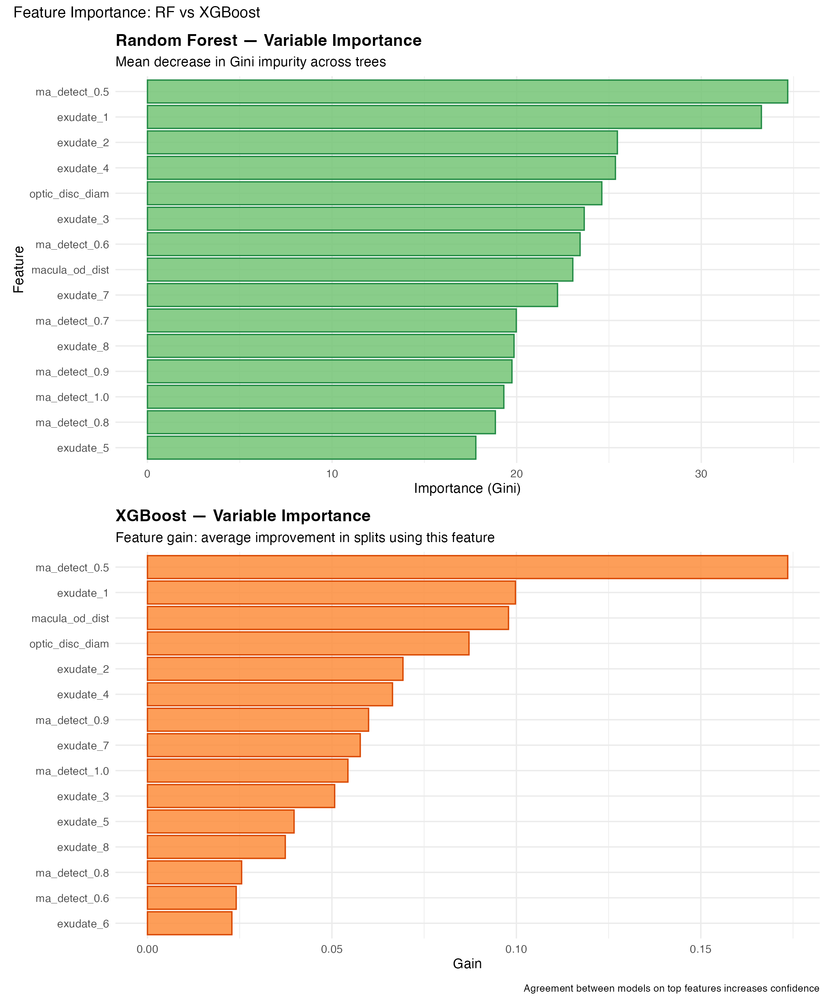
```

**Agreement between models on top features increases confidence** that these features are genuinely predictive rather than artefacts of any single algorithm's inductive bias.

## SHAP Values (XGBoost — Global)

```{r shap-summary}
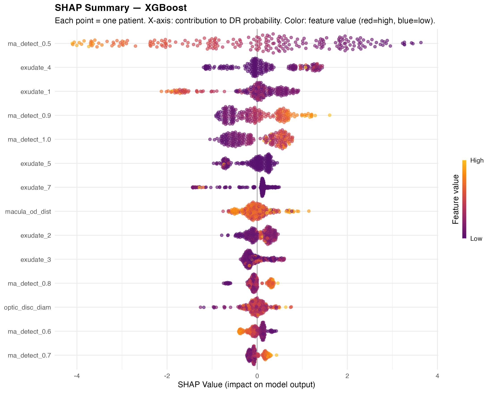
```

Each point represents one patient. The horizontal position shows whether that feature **pushed the prediction toward DR (right) or away from it (left)**. Color indicates the raw feature value (red = high, blue = low).

This plot reveals:
- **Which features matter most** (top of plot = highest mean |SHAP|)
- **Directionality**: high MA detection counts consistently increase DR probability (red points to the right)
- **Heterogeneity**: patients vary widely in how much each feature contributes

## SHAP Dependence Plots

```{r shap-dependence}
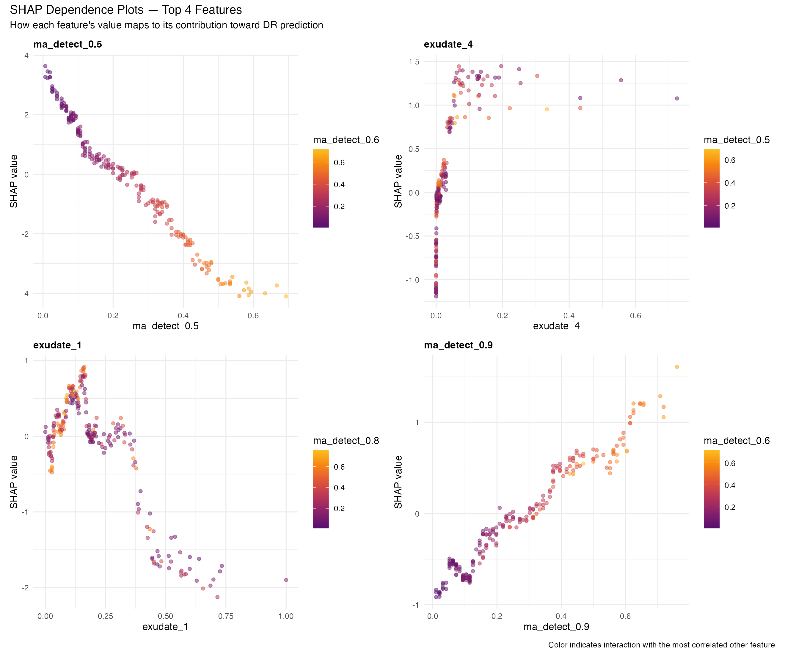
```

## SHAP for Logistic Regression

```{r shap-lr}
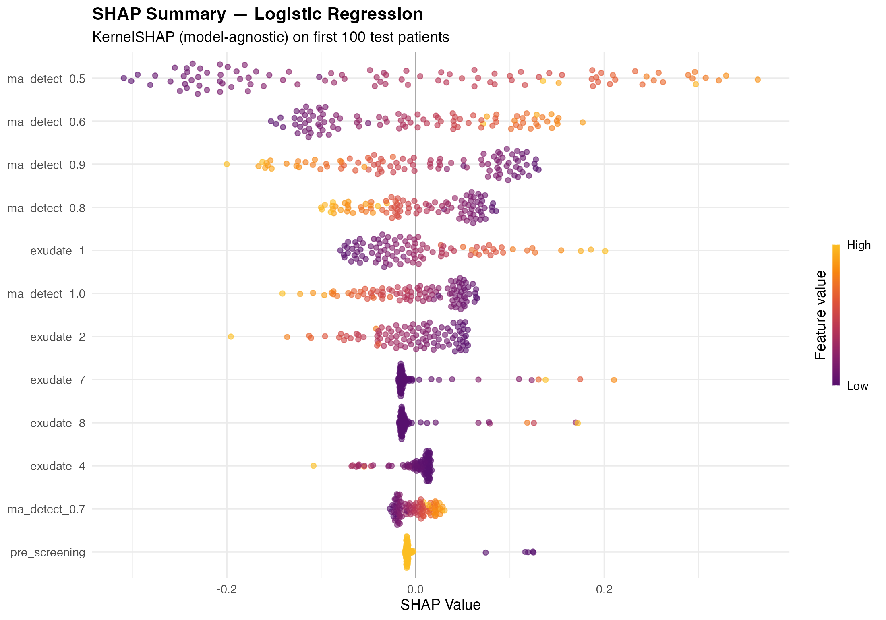
```

Applying SHAP to logistic regression confirms that **the same features drive predictions across model families**, lending credibility to their clinical relevance.

## Individual Case Narratives

### True Positive — DR Correctly Identified

```{r waterfall-tp}
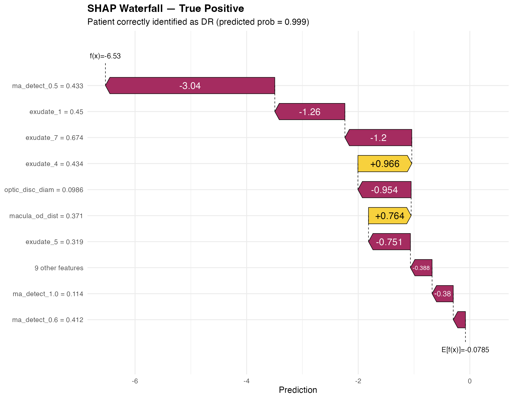
```

The waterfall plot decomposes this patient's prediction into individual feature contributions. Features pushing right (red) contribute toward a DR diagnosis; features pushing left (blue) argue against it. The final bar shows the predicted probability.

### False Negative — Missed DR Case

```{r waterfall-fn}
if (file.exists("../outputs/figures/interp_waterfall_false_negative.png")) {
  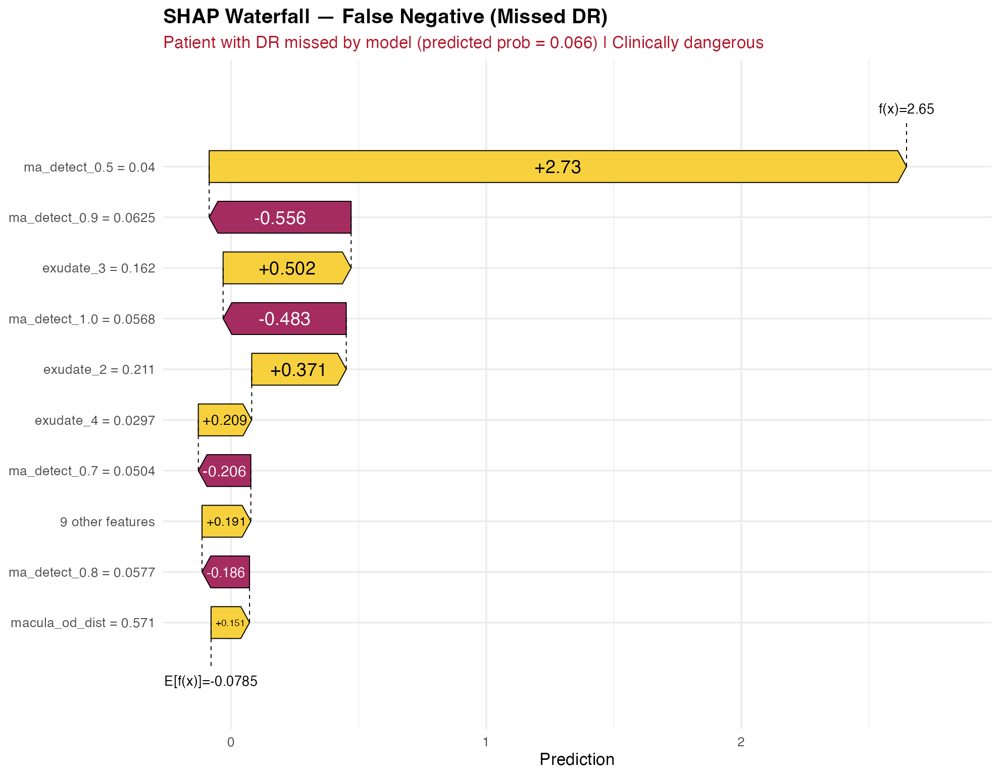
}
```

This is the clinically dangerous case — a patient with DR that the model classified as negative. The waterfall reveals *which features drove the wrong prediction*, providing actionable feedback for model improvement or clinical rule addition.

---

# Clinical Interpretation

## Screening Workflow Recommendation

Based on this analysis, the recommended deployment configuration for a DR screening tool would be:

1. **Model**: XGBoost (highest AUROC; well-calibrated probabilities)
2. **Threshold**: Optimized for ≥90% sensitivity — accept the corresponding specificity
3. **Output**: Predicted probability + contributing features (SHAP) in the report
4. **Human review**: All cases above threshold referred to ophthalmology; borderline cases (40–60% probability) flagged for clinical judgment

## Sensitivity vs. Specificity — The Clinical Tradeoff

| Scenario | Sensitivity | Specificity | Implication |
|----------|-------------|-------------|-------------|
| Default (0.5 threshold) | ~80% | ~85% | 1 in 5 DR patients missed |
| Optimized (≥90% sensitivity) | ≥90% | ~70% | More referrals, fewer missed cases |
| Aggressive (≥95% sensitivity) | ≥95% | ~55% | Near-maximum safety; high referral burden |

The right threshold depends on **healthcare system capacity**: a high-volume low-resource setting may prefer aggressive sensitivity; a specialist-scarce setting needs careful threshold calibration to avoid overwhelming ophthalmology.

---

# Limitations

1. **Fixed feature extraction pipeline**: Features were extracted by a specific image analysis system. The model's performance depends on the quality of upstream feature extraction and may not generalize to different fundus camera systems.

2. **Single-site data**: Images collected at one center (Debrecen, Hungary). Ethnic diversity, lighting conditions, and camera hardware vary across sites — external validation is essential before clinical deployment.

3. **No temporal modeling**: DR is progressive. A single-timepoint classifier cannot capture rate of change — a key clinical signal. Longitudinal modeling would improve risk stratification.

4. **ARFF normalization**: The 8 exudate features are pre-normalized, masking absolute scale information that may be clinically meaningful.

5. **Sample size**: 1,151 patients is small for a deep learning approach. This dataset is appropriate for classical ML but motivates collection of larger cohorts for future deep learning work.

---

# Reproducibility

```{r session-info, echo=FALSE}
sessionInfo()
```

To reproduce this analysis:

```r
# 1. Clone repo and download data
# 2. renv::restore()
# 3. source("R/00_run_all.R")
# 4. rmarkdown::render("reports/analysis_report.Rmd", output_dir = "outputs/")
```

---

*This project was developed as a portfolio demonstration of clinical ML methodology, with relevance to AI-assisted diagnostics and genomic variant classification tasks.*
